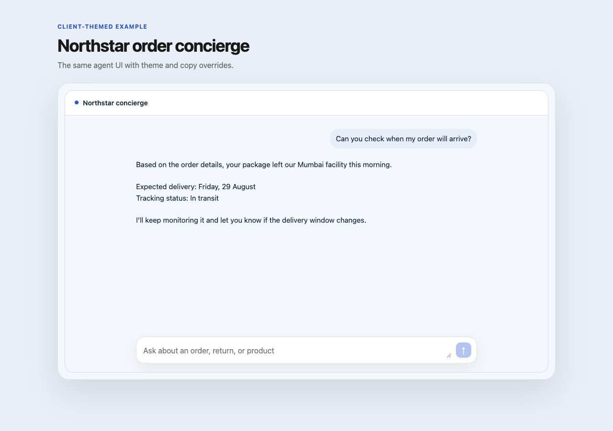

# `@codespring-app/use-agent`

The supported server and React SDK for CodeSpring Agents. It speaks a versioned
HTTP protocol and contains no Cloudflare runtime implementation, so the same
application can target CodeSpring-hosted or self-hosted endpoints.

## Server

```ts
import { createAgent, createClient } from "@codespring-app/use-agent";

const support = createAgent({
  id: "support",
  revision: "7",
  instructions: "Help the customer clearly and safely.",
  model: "support-primary",
  skills: [{ id: "returns", version: "1" }],
});

const agents = createClient({
  endpoint: process.env.CODESPRING_AGENTS_ENDPOINT!,
  apiKey: process.env.CODESPRING_AGENTS_API_KEY!,
});

const session = await agents.sessions.create(support);
await session.submit("Where is my order?", { idempotencyKey: crypto.randomUUID() });
```

`support-primary` is a tenant-scoped model profile, not a provider model name.
The control plane maps it to an encrypted BYOK connection and provider policy.
Publishing resolves the profile to an immutable policy revision while credential
rotation remains independent. Provider names and keys therefore stay out of
application source.

API keys are server-only. Do not pass the server client into a browser bundle.

## Plug-and-play React UI

```tsx
import { AgentChat, AgentProvider } from "@codespring-app/use-agent/react";

export function App() {
  return (
    <AgentProvider
      connection={{
        endpoint: "https://api.agents.codespring.app",
        getClientToken: () =>
          fetch("/api/agents/token", { method: "POST" }).then((response) => response.text()),
      }}
      theme={{ accent: "#2856d8", radius: 18 }}
      copy={{ title: "Acme support", placeholder: "Ask us anything" }}
    >
      <AgentChat sessionId="..." />
    </AgentProvider>
  );
}
```

The default components are inspired by Ferb: assistant replies are readable
document content, user messages are quiet right-aligned cards, and the composer
stays compact. `theme` and `copy` are typed and can be set at the provider or
component level.




## Headless React

Advanced clients can use `useAgentSession`, `useAgentMessages`,
`useAgentClient`, `useAgentTheme`, and `useAgentCopy` to build a completely
custom interface. The composable `AgentMessageList`, `AgentMessage`, and
`AgentComposer` primitives can also be mixed with client-owned components.

The React entrypoint only accepts a short-lived client-token callback. The
client-token endpoint is part of the platform roadmap and must be implemented
before using this flow in production.

## Local showcase

```sh
bun run showcase
```

Open `http://127.0.0.1:5173` for the default UI or append `?theme=retail` for
the themed example. The showcase uses mocked durable events and makes no
external API calls.
