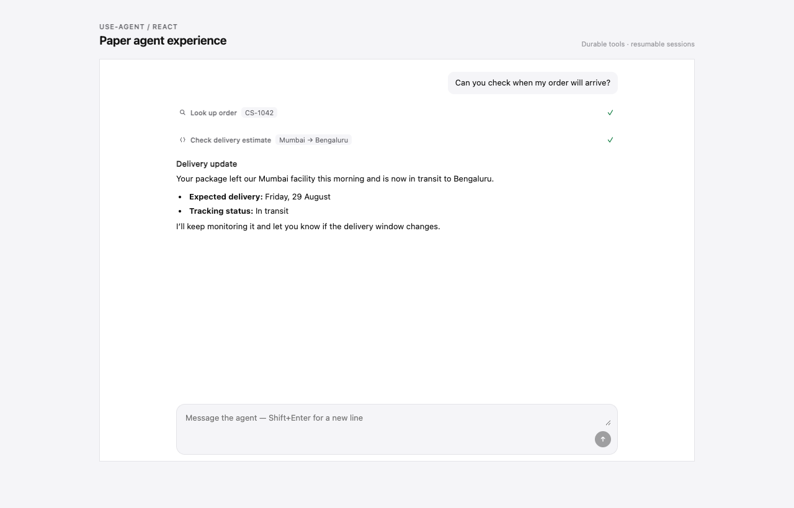

# `@codespring-app/use-agent`

The supported server and React SDK for CodeSpring Agents. It speaks a versioned
HTTP protocol and contains no Cloudflare runtime implementation, so the same
application can target CodeSpring-hosted or self-hosted endpoints.



## Server

```ts
import { createAgent, createClient } from "@codespring-app/use-agent";

const support = createAgent({
  id: "support",
  revision: "7",
  instructions: "Help the customer clearly and safely.",
  model: "production-default",
  skills: [{ id: "returns", version: "1" }],
});

const agents = createClient({
  endpoint: process.env.CODESPRING_AGENTS_ENDPOINT!,
  apiKey: process.env.CODESPRING_AGENTS_API_KEY!,
});

const session = await agents.sessions.create(support);
await session.submit("Where is my order?", { idempotencyKey: crypto.randomUUID() });
```

`production-default` is a reusable, tenant-scoped virtual model profile—not a
provider model name and not an agent/use-case configuration. Multiple agents can
reference it. The control plane maps it to encrypted BYOK connections, provider
candidates, fallback, budgets, and policy. Publishing resolves the profile to an
immutable policy revision while credential rotation remains independent.

API keys are server-only. Do not pass the server client into a browser bundle.

The same client exposes cursor-paginated control-plane reads and idempotent
mutations when its API key carries the corresponding scope:

```ts
const agentsPage = await agents.agents.list({ limit: 25 });
const tool = await agents.tools.get("customer-lookup");
```

## CLI and coding-agent skill

The package installs a `use-agent` executable and exports a testable Node-only
entrypoint at `@codespring-app/use-agent/cli`.

```sh
npx @codespring-app/use-agent skills get app-builder
npx @codespring-app/use-agent skills install --target codex --yes
npx @codespring-app/use-agent auth login
npx @codespring-app/use-agent auth status --json
```

`skills get` works offline and verifies the bundled content digest. The small
installed discovery skill points coding agents back to this version-matched
catalog. Source changes and remote publication remain separate permissions.

For local development, `auth login` opens CodeSpring in the browser and displays
a short verification code. The human approves the exact CLI request and account;
the CLI stores the refresh credential in macOS Keychain or Linux Secret Service,
never in its JSON config or project files. Use `--no-browser` on a remote shell
and open the displayed URL yourself.

For headless server/CI access, put a scoped key in
`CODESPRING_AGENTS_API_KEY`; credentials are never accepted as command-line
arguments or persisted by the CLI. An environment API key takes precedence over
device login.

## Customer-hosted Node tools

Advanced tools run in your application, with your dependencies, network access,
and database clients. CodeSpring sends a short-lived signed invocation; the SDK
verifies it before dispatching the exact published handler revision.

```ts
import {
  createToolHandler,
  defineTool,
} from "@codespring-app/use-agent";
import { db } from "./db";
import { toolExecutionStore } from "./durable-tool-execution-store";

const lookupCustomer = defineTool<{ customerId: string }, { name: string }>({
  name: "lookup_customer",
  revision: "2026-08-30.1",
  description: "Look up a customer in the application database.",
  inputSchema: {
    type: "object",
    properties: {
      customerId: { type: "string", minLength: 1, maxLength: 100 },
    },
    required: ["customerId"],
    additionalProperties: false,
  },
  risk: "read",
  async execute({ customerId }, context) {
    return db.customers.findForAgent(customerId, {
      operationId: context.operationId,
      signal: context.signal,
    });
  },
});

export const POST = createToolHandler({
  endpoint: "https://app.example.com/api/agent-tools",
  tools: [lookupCustomer],
  executionStore: toolExecutionStore,
});
```

Register the matching tool in the Agents dashboard:

- Executor: `Customer-hosted Node tool`
- Endpoint: `https://app.example.com/api/agent-tools`
- Model-visible name: `lookup_customer`
- Handler revision: `2026-08-30.1`
- Input schema and risk: the same values used by `defineTool`

The handler is based on the standard `Request`/`Response` APIs, so the same
function works in Next.js route handlers, Hono, Bun, and Node adapters. Keep old
handler revisions deployed while published agents or resumable sessions can
still reference them.

A dependency-injected handler example is included at
[`examples/customer-hosted-tool.ts`](./examples/customer-hosted-tool.ts).

`executionStore` is mandatory. Its `run` method must atomically join concurrent
calls and replay a completed result for the supplied tenant-scoped operation
key. Use a durable database or key-value store in production. The included
`createMemoryToolExecutionStore()` is only for local development and tests.

```ts
import {
  createMemoryToolExecutionStore,
  executeToolLocally,
} from "@codespring-app/use-agent";

await executeToolLocally(lookupCustomer, { customerId: "cus_123" });

const localHandler = createToolHandler({
  endpoint: "https://tools.example.test/agent-tools",
  issuer: "https://runtime.example.test",
  jwks: localTestJwks,
  tools: [lookupCustomer],
  executionStore: createMemoryToolExecutionStore(),
});
```

Write tools receive the same stable `context.operationId`. Use it as the
idempotency key for the underlying mutation in addition to the handler-level
execution store. Arbitrary uploaded code is not executed by the hosted runtime.

## Plug-and-play React UI

```tsx
import {
  AgentChat,
  AgentProvider,
  createAgentAppearance,
  createAgentClient,
} from "@codespring-app/use-agent/react";

const agentClient = createAgentClient({
  endpoint: "https://api.agents.codespring.app/browser",
  clientTokenEndpoint: "/api/agents/token",
});

const acmeAppearance = createAgentAppearance({
  theme: { accent: "#2856D8" },
  copy: { placeholder: "Ask us anything" },
});

export function App({ sessionId }: { sessionId: string }) {
  return (
    <AgentProvider client={agentClient} appearance={acmeAppearance}>
      <AgentChat sessionId={sessionId} />
    </AgentProvider>
  );
}
```

`/api/agents/token` returns `{ token, expiresAt }`. The SDK caches it in memory,
deduplicates concurrent refreshes, refreshes before expiry, and retries once
after a 401. It never persists the token. `createAgentAppearance` produces a
frozen, reusable preset so unrelated renders do not invalidate theme/copy
consumers; use `useMemo` when appearance must be dynamic.

The `/browser` endpoint is intentional: it accepts only short-lived client
tokens and is the only runtime surface with browser CORS. Server API keys stay
on the endpoint root and must never be shipped to a browser.

The React session store loads durable history, then switches to a live
WebSocket using a 30-second, single-use ticket. It keeps one contiguous event
cursor, removes replay/live duplicates, repairs gaps over HTTP, and reconnects
with bounded jitter. `useAgentSession` exposes `connection` as `idle`,
`connecting`, `live`, `reconnecting`, or `closed` for custom status UI.

The default Paper experience renders assistant replies as document content on
an edge-to-edge canvas, user messages as quiet trailing wells, tool calls as
compact inspectable activity rows, and the live-edge composer without a shadow.
`paperLightTheme`, `paperDarkTheme`, theme/copy overrides, slots, and render
functions are available for customization.

Message actions are opt-in. Copy can work locally; retry and feedback are
callback-driven so applications can call their authenticated, rate-limited
server endpoints. Token totals are reduced only from durable runtime usage
events.

```tsx
<AgentChat
  sessionId={sessionId}
  messageActions={{
    retry: "failed",
    feedback: "binary",
    copy: true,
    usage: "tokens",
  }}
  onRetryMessage={(message) => retryTurn(message.turnId)}
  onFeedback={(message, value) => submitFeedback({
    turnId: message.turnId,
    messageId: message.id,
    value,
  })}
/>
```

Setting an action option only changes presentation. It does not grant runtime
scopes or bypass server-side authorization, idempotency, quotas, or abuse
controls.

Assistant text is rendered as hardened, streaming-safe GFM through Streamdown.
Fenced code uses the exported `AgentCodeBlock`, with a readable immediate
fallback and lazy Shiki highlighting. The renderer requires no Tailwind source
configuration, shadcn variables, or global stylesheet.

```tsx
import {
  AgentCodeBlock,
  AgentMarkdown,
} from "@codespring-app/use-agent/react";

<AgentMarkdown streaming={isStreaming}>
  {generatedMarkdown}
</AgentMarkdown>

<AgentCodeBlock
  code={'const agent = createAgent({ id: "support" });'}
  language="typescript"
  filename="agent.ts"
  showLineNumbers
/>
```

The highlighted language set covers common web, systems, mobile, data, and
scripting languages—including TypeScript, Python, Go, Rust, Java, SQL, shell,
HTML/CSS, and JSON. Grammars load only when used. Unknown language identifiers
fall back to plain code instead of failing. Raw HTML and remote images are
disabled in model Markdown by default; advanced clients can pass semantic
component overrides to `AgentMarkdown`.

The React entrypoint also includes bounded generative-UI controls. Applications
provide typed data; the component never evaluates model-authored HTML, styles,
URLs, handlers, or code:

```tsx
import { AgentGenerativeUI } from "@codespring-app/use-agent/react";

<AgentGenerativeUI
  request={{
    requestId: "model-priority",
    kind: "choice",
    title: "What matters most?",
    options: [
      { id: "quality", label: "Best quality" },
      { id: "speed", label: "Faster responses" },
    ],
  }}
  onSubmit={(response) => saveResponse(response)}
/>
```

`AgentMarkdown`, `AgentCodeBlock`, and `AgentGenerativeUI` can render
standalone. Session hooks and connected chat components still require
`AgentProvider`.

## CSS variables, Tailwind CSS, and StyleX

Every default component resolves theme tokens through inherited
`--codespring-agent-*` custom properties. Variables override the appearance
preset; unset variables use the selected Paper or custom appearance value as a
fallback.

```css
.acme-agent-theme {
  --codespring-agent-accent: #2856d8;
  --codespring-agent-container-radius: 18px;
  --codespring-agent-content-max-width: 52rem;
}
```

The public names are also exported as `agentThemeVariables`. Supported tokens
are `canvas`, `ink`, `inkSecondary`, `inkTertiary`, `well`, `hairline`,
`statusGood`, `statusBad`, `statusWarn`, `accent`, `fontFamily`, `monoFamily`,
`contentMaxWidth`, `containerRadius`, and `wellRadius`.

Tailwind CSS can set the variables on any ancestor:

```css
@theme {
  --color-acme-primary: #2856d8;
}
```

```tsx
<div className="[--codespring-agent-accent:var(--color-acme-primary)] [--codespring-agent-container-radius:18px]">
  <AgentProvider client={agentClient} appearance={acmeAppearance}>
    <AgentChat sessionId={sessionId} />
  </AgentProvider>
</div>
```

StyleX variables can be used as appearance values and themed from an ancestor:

```tsx
// agent-theme.stylex.ts
import * as stylex from "@stylexjs/stylex";

export const agentTokens = stylex.defineVars({ accent: "#3B6AC5" });
```

```tsx
import * as stylex from "@stylexjs/stylex";
import { agentTokens } from "./agent-theme.stylex";

const brandedTheme = stylex.createTheme(agentTokens, { accent: "#2856D8" });
const stylexAppearance = createAgentAppearance({
  theme: { accent: agentTokens.accent },
});

<div {...stylex.props(brandedTheme)}>
  <AgentProvider client={agentClient} appearance={stylexAppearance}>
    <AgentChat sessionId={sessionId} />
  </AgentProvider>
</div>;
```

## Headless React

Advanced clients can use `useAgentSession`, `useAgentMessages`,
`useAgentToolCalls`, `useAgentClient`, `useAgentTheme`, and `useAgentCopy` to
build a completely custom interface. The composable `AgentMessageList`,
`AgentMessage`, `AgentToolCall`, and `AgentComposer` primitives can also be
mixed with client-owned components.

The browser entrypoint never accepts an API key. A trusted application backend
must issue short-lived, origin-bound client tokens.

For a non-React browser UI, connect to the same durable stream directly:

```ts
const session = agentClient.sessions.get(sessionId);
const connection = await session.connect({
  after: lastAppliedCursor,
  onEvent(event) {
    // Persist or reduce the event, then advance lastAppliedCursor.
  },
  onReplayComplete(cursor) {
    console.log("Live at", cursor);
  },
});

connection.close();
```

The SDK performs the authenticated ticket exchange and automatically follows
multi-page WebSocket replay. `AgentEventBuffer` is available to headless
clients that want the same contiguous-cursor, deduplication, and gap-detection
rules as the React store.

## Local showcase

```sh
bun run showcase
```

Open `http://127.0.0.1:5173` for the Paper UI or append `?theme=dark` for
the dark palette. The showcase uses mocked durable events and makes no
external API calls.
